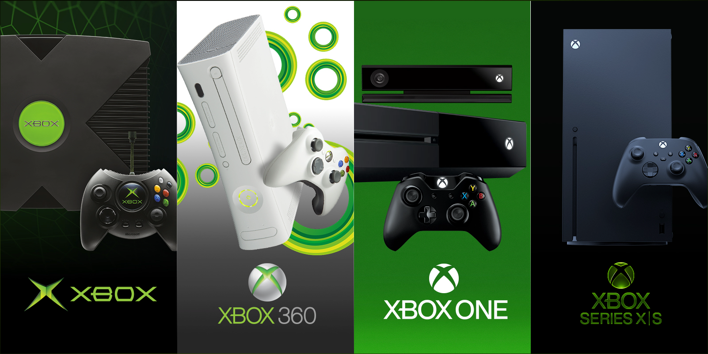
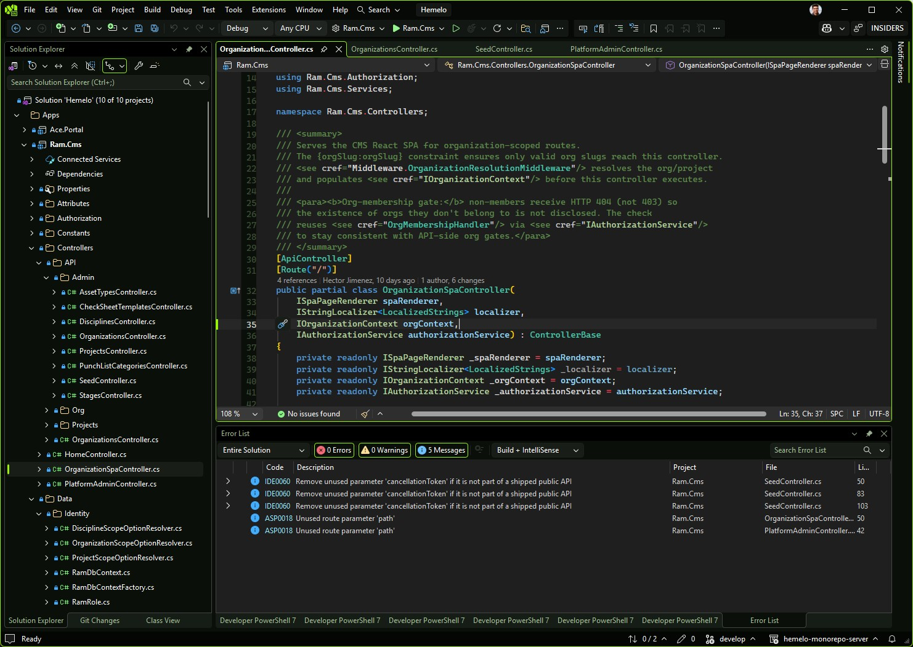
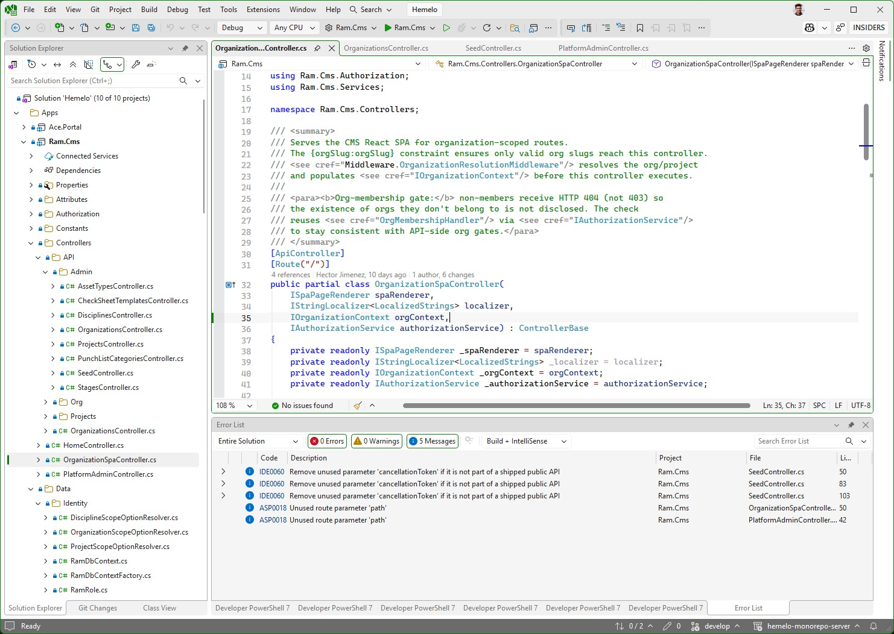
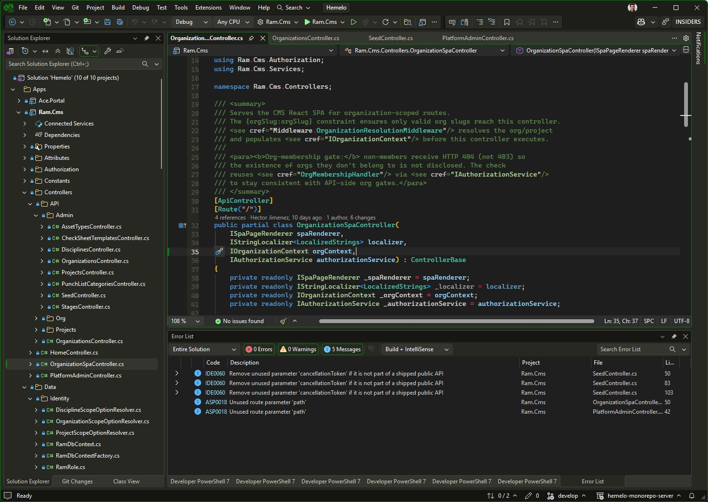
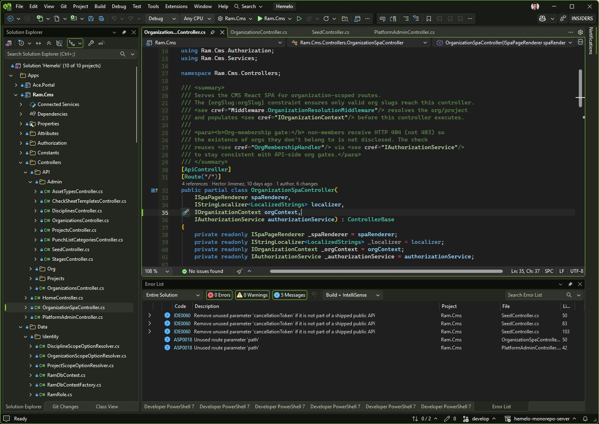
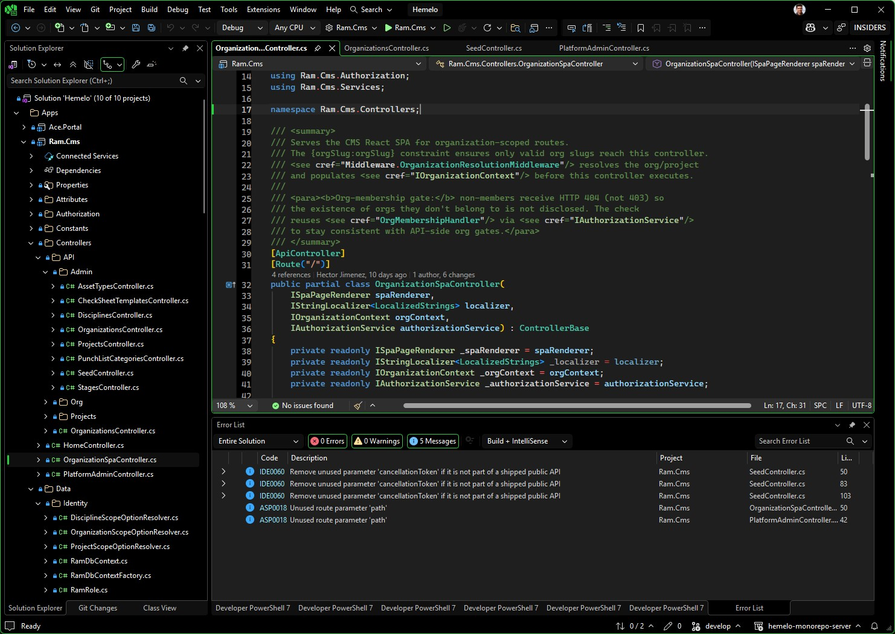
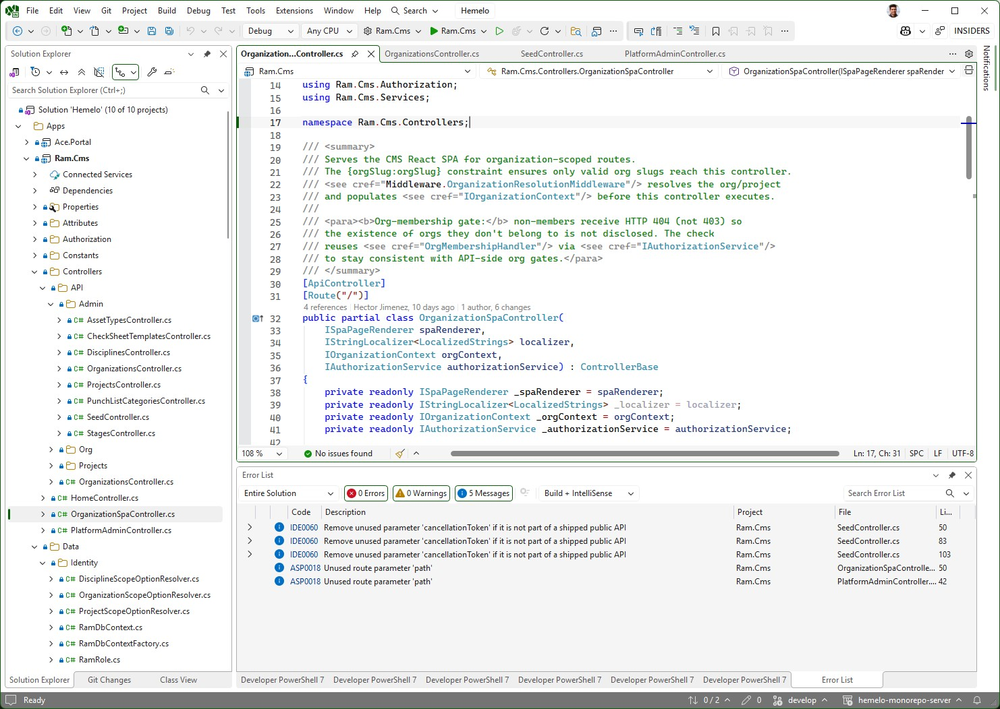

# Xbox Themes for Visual Studio

[](https://marketplace.visualstudio.com/items?itemName=hector-jimenez.vs-xbox-theme)
[](https://marketplace.visualstudio.com/items?itemName=hector-jimenez.vs-xbox-theme)
[](LICENSE)
[](https://visualstudio.microsoft.com/)

Six Xbox-inspired color themes for **Visual Studio 2026** — a sibling port of [`vs-code-xbox-theme`](https://github.com/hectorjjb/vs-code-xbox-theme) sharing the same canonical palette.



## Themes

**Console editions** (chronological)

- **Xbox Original (2001)** — dark, matte-black base with the translucent neon-green "jewel" accent (`#9bf00b`).
- **Xbox 360 (2005)** — clean light variant with classic Xbox green accents.
- **Xbox One (2013)** — the deep-charcoal dashboard look.
- **Xbox Series X (2020)** — 25th Anniversary edition: neutral warm grays with a soft controller-lime accent.

**High Contrast editions** (accessibility)

- **Xbox High Contrast (Dark)** — pure-black background, white text, vivid green accent (`#2ecc40`, ~9.8:1 contrast).
- **Xbox High Contrast (Light)** — pure-white background, black text, deep green/blue contrast borders.

## Screenshots

| | |
| :---: | :---: |
| **Xbox Original** | **Xbox 360** |
|  |  |
| **Xbox One** | **Xbox Series X** |
|  |  |
| **Xbox High Contrast (Dark)** | **Xbox High Contrast (Light)** |
|  |  |


## Install

### From the Marketplace (recommended)

1. In **Visual Studio 2026** → **Extensions** → **Manage Extensions** → **Browse** tab → search **"Xbox Themes"**.
2. Click **Install**, then restart VS when prompted.
3. **Tools → Theme → \<pick any Xbox theme\>**.

Or visit the gallery: <https://marketplace.visualstudio.com/items?itemName=hector-jimenez.vs-xbox-theme>

### Side-load a `.vsix`

1. Download the latest `.vsix` from [Releases](https://github.com/hectorjjb/vs-xbox-theme/releases) (or build locally — see below).
2. Double-click the `.vsix` to launch **VSIX Installer**, accept, and let it install for VS 2026.
3. Restart Visual Studio and pick a theme via **Tools → Theme**.

### Build from source

```powershell
git clone https://github.com/hectorjjb/vs-xbox-theme.git
cd vs-xbox-theme
npm install
npm run package    # → dist\hector-jimenez.vs-xbox-theme-<version>.vsix
```

Prerequisite: **Visual Studio extension development** workload installed (provides `VsixColorCompiler.exe`). Open **Visual Studio Installer** → **Modify** → check the workload → **Modify**.

To regenerate just the XML (no VSIX):

```powershell
npm run build              # all 6 flavors
npm run build:series-x     # one flavor → dist\xbox-series-x.vstheme
```

## How it works (VS 2026 theming model)

VS 2026 ships a [new minimal theme schema](https://learn.microsoft.com/en-us/visualstudio/extensibility/migration/modernize-theme-colors):

- ~229 tokens across **5 + 7 editor categories** (down from ~1,806 across ~34 in VS 2022).
- A `FallbackId` attribute on `<Theme>` inherits everything not overridden from a built-in **Light** or **Dark** theme — we declare ~159 tokens per flavor across 12 categories that give each flavor its identity.
- **No "Import Theme" UI** in VS 2026. Custom themes ship as a **VSIX**.

See [`docs/COVERAGE.md`](docs/COVERAGE.md) for the complete per-category breakdown.

## Compatibility

| Version | Status |
| ------- | ------ |
| Visual Studio 2026 (18.x) | ✅ Primary target |
| Visual Studio 2022 | ❌ Modernized theme schema is VS 2026-only |
| VS Code | Use the [sibling extension](https://github.com/hectorjjb/vs-code-xbox-theme) |

## Publishing

To release to the Visual Studio Marketplace:

```powershell
npm run package    # build the VSIX
npm run publish    # uploads via VsixPublisher.exe; needs $env:VS_MARKETPLACE_PAT
```

See [`docs/PUBLISHING.md`](docs/PUBLISHING.md) for the full one-time setup (publisher account, PAT) and per-release workflow.

## Repo layout

```
src/
  palette.json                            ← shared with vs-code-xbox-theme (source of truth)
  mapping/vs-key-map.json                 ← VS 2026 token map (DecorativeMPF + Shell + ShellInternal + Editor)
  flavors/*.json                          ← per-flavor metadata (name, GUID, FallbackId, accentFg)
  reference/                              ← decoded built-in theme pkgdefs (for development)
  vsix/
    extension.vsixmanifest.template       ← VSIX manifest with {{TOKEN}} placeholders
    [Content_Types].xml                   ← OPC content type map
images/                                   ← icon.png + preview.png for Extension Manager
scripts/
  build-vstheme.mjs                       ← XML generator (role+alpha syntax, extraRoles merge)
  build-vsix.mjs                          ← VSIX packager (compile, header inject, stage, zip)
  decode-pkgdef.mjs                       ← pkgdef binary blob inspector
dist/                                     ← generated .vstheme, .pkgdef, .vsix (gitignored)
```

## Contributing

Issues and PRs welcome — please file at <https://github.com/hectorjjb/vs-xbox-theme/issues>.

## License

[Apache-2.0](LICENSE) © Hector Jimenez
